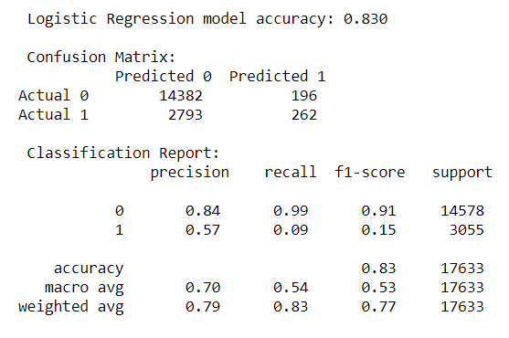
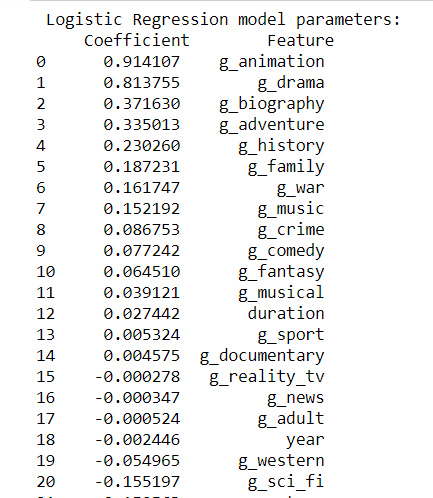
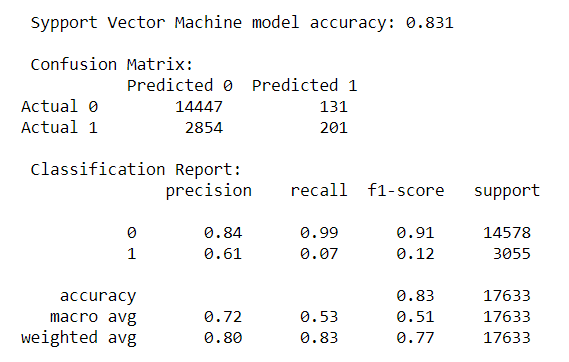
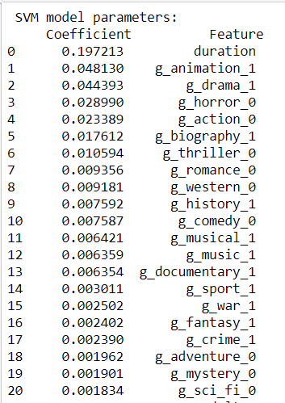

## Machine Learning Model Segment 3

## Preliminary Data Processing

Three datasets were found in Kaggle and reviewed for viability:

1 - source: IMDb Movies Extensive Dataset

    https://www.kaggle.com/stefanoleone992/imdb-extensive-dataset

    file: https://www.kaggle.com/stefanoleone992/imdb-extensive-dataset/download

    Contains metadata scraped from IMDB movies with at least 100 votes as of 1/1/2020

2 - The Movies Dataset

    source: https://www.kaggle.com/rounakbanik/the-movies-dataset?select=movies_metadata.csv

    file: https://www.kaggle.com/rounakbanik/the-movies-dataset/download

    Contains metadata from the Full MovieLens Dataset for movies released on or before July 2017.

3 - Film Awards (IMDB)

    source: https://www.kaggle.com/iwooloowi/film-awards-imdb

    Last updated 3/25/2020

The datasets are not well-documented so an extensive data analysis and cleaning process evaluated each variable to determine it's contents and viability as a data element in the model. Where data was available from two sources for comparison, additional validation established their similiarity and differences. Data elements were spot-checked against the source websites to ensure data was correctly captured and interpreted.

Some common issues in cleaning the data had to be overcome, including:
* Strings of data that appeared to be in json format were not and had to be processed through string evaluation to extract the contents
* Mixed data types within a data element that had to be identified and properly converted to the same data type
* Currency abbreviations attached to numbers that casued the inferred data types to be rendered as strings 
* Raw data scraped from websites is generally prone to inconsistency in data structures, inconsistency in data encoding and data entry errors. This variability in data elements places great importance on discerning the actual meaning of values, matching strings to identify dictinct categories, and devising appropriate transformations for use in machine learning models

The datasets were cleaned separately to handle their specific data issues and then merged on IMDB ID number for comparisons and creation of the final input dataset.

Although machine learning models can handle some "messy" data, cleaning and standardizing data in an appropriate fashion before inputting to the model development should result in a model that requires less training and tuning

## Preliminary feature engineering and preliminary feature selection, including decision-making process

Preliminary feature engineering and selection focused on identifying cleanliness and presence of data elements, as well as the ability to transform the data element into a meaningful and useful model variable. As a group, the team reviewed the data elements and made decisions on individual variables. Some variables were discarded due to the difficulty and time required to process. For example, there are over 19,000 production companies, and some movies had 10 or more production companies involved. Similarly, the number of countries in production and the number of actors for each movie produce an overwhelming number of possible combinations. Other variables were discarded due to the the high number of missing values and inability to impute missing values. 

In comparing the IMDB and the TMDB meta data it became clear the two datasets agreed very well in their contents, but the IMDB data was more current, containing many more movies. As a result, IMDB data is the main source, supplemented as possible by TMDB data. Model evaluation will determine whether the resulting missing values can be used. 

The awards dataset contained over 2 million records covering more than 16,000 different awards for the years 1970 to 2020. Again, the time and effort required to clean and transform the data made this dataset unuseable in the project time frame.

Source code for cleaning datasets:

IMDB data:
* notebook: IMDB_database_cleanup.ipynb
* output file: imdb_main.csv

TMDB data:
* notebook: TMDB_database_cleanup.ipynb
* output file: tmdb_main.csv

Awards data:
* notebook: Merging_IMDB_Awards
* file: N/A

Merged IMDB and TMDB:
* notebook: Merging_IMDB_Awards
* output file: merged_movies.csv

In Segment 3, we explored using director information as a feature in the model. We identified two hypotheses:
* Hypothesis 1: More movies associated with a director indicates the director is considered more worthy of investment. The number of movies credited to a director may be correlated with success.

    58% of directors have 1 movie
    17% of directors have 2 movies
     7% of directors have 3 movies

* Hypothesis 2: Each director's personal track record (number of successful movies / total numbers of movies credited) may be associated with future successful movies.

Director names were provided in a string with up to two names. Each unique director name was identified and two pieces of data were calculated: the number of movies credited to the director, and director's personal win rate (number of successful movies / number of movies credited to the director). These new variables were attached to each movie for each director. Where two directors were involved, the maximum values across the two directors was kept.

Models using these director features had accuracy rates around 90%, however we realized these features were calculated across the entire dataset rather than calculated per sample or calculated on a older dataset and used to predict on more recent movies releases. Small wonder the accuracy was so high. Trying to calculate these variables after selecting the samples became too difficult to accomplish in the available time, so director features were dropped from consideration.

## How data was split for training and testing sets

Train, test and validation datasets were created. Stratified sampling was done to ensure representativeness of success outcome in all samples. The Valdation dataset was set at 30% of the sample and used in loss and accuracy graphs to aid in assessing the deep learning model fit.

## Explanation of model choice, including limitations and benefits

Objective: Predict whether or not a movie will be successful. 

The possible metrics of success identified apriori included : profit = revenue - budget, voter ratings, and awards won. As we learned more about the input datasets, we found budget and revenue numbers were sparsely populated, rendering them unusable as the predicted value. Awards data, though available, was too unwieldy to be of use in our timeframe. Thus, ratings data elements were the only viable option.

The dataset contains various rating variables:
* vote average  - this is not an unweighted average across all IMDB users. This is a weighted average based on an undisclosed IMDB propietary algorithm. Scores range from 1 to 10.
* number of votes from IMDB users
* number of reviews from critics
* numner of reviews from IMDB users

The modeling in Segment 4 used IMDB score >= 7 to define success. The IMDB score ranges between 1 and 10.

We looked at logistic regression, support vector machine, deep learning models and random forest.

The machine learning model program was built to support the four different models and to produce similar output for each model. The user selects the model in the second cell. 

### Comparison of Models

the accuracy curve for nn shows validation accuracy always higher than training. Is there an issue with the sample? maybe not representative of validation? Changed random_state variable. That fixed the problem, but validation loss increases after about 8 epochs, so overfitting. Reduced epochs to 10.

o rerun for all models

## Random Forest

[notebook:](Random_Forest_output_final.ipynb)
[hmtl notebook:](Random_Forest_output_final.html)

### Logistic Regression

[notebook:](Logistic_Regression_output_final.ipynb)
[html notebook:](Logistic_Regression_output_final.html)

### Support Vector Machine

 
 

[notebook:](Support_Vector_Machine_output_final.ipynb)
[html notebook:](Support_Vector_Machine_output_final.html)

### Deep Learning

The current model has two hidden layers utilizing the tanh activation function. Tanh is a better fit to the zero-centered scaled data than relu, because tanh accommodates negative values. The output variable will be based on the probability of (IMDB score >= 7), so the output layer has one node with a sigmoid activation function.

Early Model:

[notebook:](Neural_Network_output_0.ipynb)
[html notebook:](Neural_Network_output_0.html)

Final Model:

[notebook:](Neural_Network_output_final.ipynb)
[html notebook:](Neural_Network_output_final.html)

### Bullets for presentation:

- Although we started out with an enormous amount of data, once we finished cleaning and evaluating the data we were left with a small set of variables as features: genres, directors, duration of the movie, and release year
- Also, although we started out with three different types of metrics for measuring success, again, after cleaning and evaluation we were left with the IMDB score, which is based on a proprietary algotithm on user ratings
- We tested three (four with Andrew's investigations) models, that all performed similarly, resulting in accuracy of 90%. 
- I would like to add more on the results of the models which I can do on Sunday
- Improvements to be explored: using awards data, actors.
- Improvements: set up samples to build a model for predicting future success. The current approach classifies winning movies well, but it is not designed to predict future success.