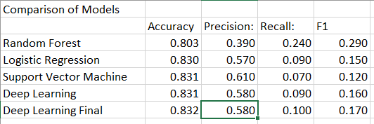

# Can We Forecast Film Success?
>A Study of Cinema Using Machine-Learning

## Introduction
Everyone loves movies -- or, at least has an opinion about them. Since cinema has recently been reshaped by the rise of streaming and the onset of the COVID-19 pandemic, we've set out anew to understand what makes movies work. Using data-wrangling skills in Python, and machine-learning skills from packages such as scikit-learn, we plan to answer: What makes movies successful?

#### Defining Success
Before predicting if a movie will be successful, first we must understand what it means for a movie to be successful. We defined success by three primary factors:
Popularity (ratings, both proprietary and critic)
Profitability (revenue – estimated budget)
Acclaim (industry award winning)

#### Data
We used multiple datasets to aid our inquiry, primarily from sources such as The International Movie Database (IMDb) and The Movies Database (TMDB). The former has compiled data on movie plots, critic and user reviews and ratings, and awards; the latter includes variables such as cast and crew, budgets and box office returns.

While we initially explored using film awards data from IMDb, our initial exploration revealed that this data was problematic due to variety (categorical data, often with multiple data points combined together into one) and veracity (key data was either entirely missing or not reliable).

#### Team members and roles
* Maggie Allen – Presentation, GitHub, Project Manager
* Andrew Malony – Visualizations, Dashboard
* Kathy Morrissey – Data Clean-up, Machine Learning Model
* Rose Baumann – Data Clean-up, Database

#### Communication Protocols
Each member of the team is accessible via Slack, both individually and via a group channel named "the_clever_crew." We've stayed in relatively frequent touch in and out of class, and have planned video calls outside of class.

## Overview of Database and Model

### Data Cleaning and Exploratory Analysis

Ultimately two datasets from Kaggle were used: data from IMDB and data from TMDB (The Movies Database).

IMDB data cleaning, evaluation, selection:

[notebook: IMDB_database_cleanup.ipynb](IMDB_database_cleanup.ipynb)

[notebook with exploratory graphics: Exploratory/IMDB_exploratory_analysis.ipynb](Exploratory/IMDB_exploratory_analysis.ipynb)

TMDB data cleaning, evaluation, selection:

[notebook: the_movie_database_cleanup.ipynb](the_movie_database_cleanup.ipynb)

[notebook with exploratory graphics: Exploratory/The_Movies_database_cleanup_with_exploratory_analysis.ipynb](Exploratory/The_Movies_database_cleanup_with_exploratory_analysis.ipynb)

Merged IMDB and TMDB evaluation:

[notebook: Merging_IMDB_TMDB.ipynb](Merging_IMDB_TMDB.ipynb)

[notebook with exploratory graphics: Merged_IMDB_TMDB_with_feature_selection.ipynb](Merged_IMDB_TMDB_with_feature_selection.ipynb)

### Cloud-based Database

The two cleaned datasets IMDb_main.csv and TMDB_main.csv were uploaded to postgres in AWS, some additional data cleaning was performed, the tables were joined and output to a new table in AWS:

[notebook: Database/postgres_clean.ipynb](Database/postgres_clean.ipynb)

[ERD: Database/Database_ERD.png](Database/Database_ERD.png)

We pivoted from using colab as our data was not 'big data' to using jupyter notebook to 'talk to AWS'

### Machine Learning Model

Four types of models were evaluated: Random Forest, Logistic Regression, Support Vector Machine, and Deep Learning. 

[notebook: Random_Forest_output_final.ipynb](Machine_Learning/Random_Forest_Model_output_final.ipynb)

[notebook: Logistic_Regression_output_final.ipynb](Machine_Learning/Logistic_Regression_output_final.ipynb)

[notebook: Support_Vector_Machine_output_final.ipynb](Machine_Learning/Support_Vector_Machine_output_final.ipynb)

[notebook: Neural_Network_output_final.ipynb](Machine_Learning/Neural_Network_Model_output_final.ipynb)

## Results

All of the models are poor at classifying successful movies. It is not surprising given the paucity of data to work with. The models need more relevant features in order to improve their classification power.

> Having a ton of data doesn’t necessarily mean it is useful.

Where do we go from here? 

* Seek Out Additional Data Sources (Awards, A-list, Rotten Tomato, etc.)
* Deep Dive Categorical Variables
* Natural Language Processing of Reviews
* Machine Learning Models for Predicting Future Success

### Tableau Dashboard

[https://public.tableau.com/app/profile/am5877/viz/movie_success_predictor_graphs/Dashboard1?publish=yes](https://public.tableau.com/app/profile/am5877/viz/movie_success_predictor_graphs/Dashboard1?publish=yes)

### Presentation

#### Google Slides
[https://docs.google.com/presentation/d/1IhlclkFM0oyjiw7FiD08mJyhuT0GeN9XTxWHweYqsPg/edit#slide=id.gecf99a74e9_0_5](https://docs.google.com/presentation/d/1IhlclkFM0oyjiw7FiD08mJyhuT0GeN9XTxWHweYqsPg/edit#slide=id.gecf99a74e9_0_5)

### Google Slides Slideshow
[https://docs.google.com/presentation/d/1IhlclkFM0oyjiw7FiD08mJyhuT0GeN9XTxWHweYqsPg/edit#slide=id.gcb9a0b074_1_0](https://docs.google.com/presentation/d/1IhlclkFM0oyjiw7FiD08mJyhuT0GeN9XTxWHweYqsPg/edit#slide=id.gcb9a0b074_1_0)
