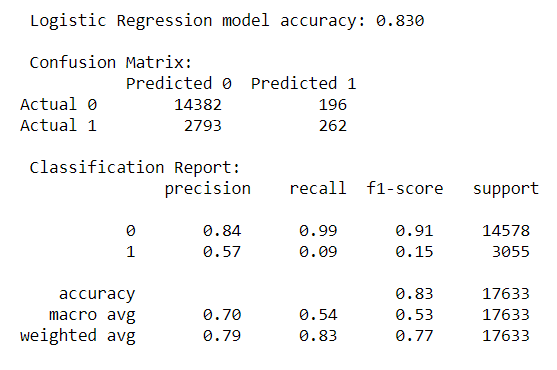
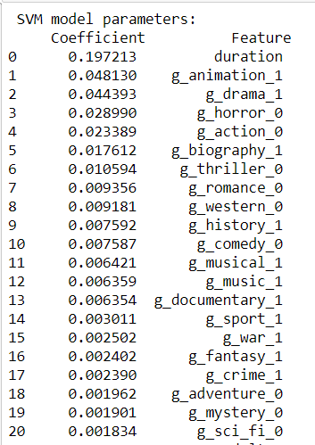
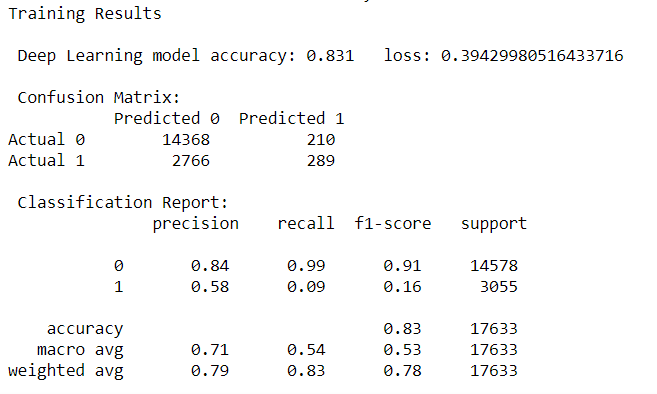
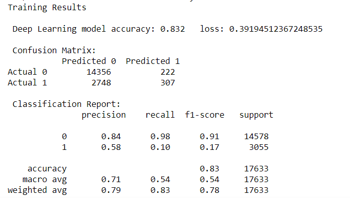

## Machine Learning Model Segment 4

## Preliminary Data Processing

Three datasets were found in Kaggle and reviewed for viability:

1 - source: IMDb Movies Extensive Dataset

    https://www.kaggle.com/stefanoleone992/imdb-extensive-dataset

    file: https://www.kaggle.com/stefanoleone992/imdb-extensive-dataset/download

    Contains metadata scraped from IMDB movies with at least 100 votes as of 1/1/2020

2 - The Movies Dataset

    source: https://www.kaggle.com/rounakbanik/the-movies-dataset?select=movies_metadata.csv

    file: https://www.kaggle.com/rounakbanik/the-movies-dataset/download

    Contains metadata from the Full MovieLens Dataset for movies released on or before July 2017.

3 - Film Awards (IMDB)

    source: https://www.kaggle.com/iwooloowi/film-awards-imdb

    Last updated 3/25/2020

The datasets are not well-documented so an extensive data analysis and cleaning process evaluated each variable to determine it's contents and viability as a data element in the model. Where data was available from two sources for comparison, additional validation established their similiarity and differences. Data elements were spot-checked against the source websites to ensure data was correctly captured and interpreted.

Some common issues in cleaning the data had to be overcome, including:
* Strings of data that appeared to be in json format were not and had to be processed through string evaluation to extract the contents
* Mixed data types within a data element that had to be identified and properly converted to the same data type
* Currency abbreviations attached to numbers that casued the inferred data types to be rendered as strings 
* Raw data scraped from websites is generally prone to inconsistency in data structures, inconsistency in data encoding and data entry errors. This variability in data elements places great importance on discerning the actual meaning of values, matching strings to identify dictinct categories, and devising appropriate transformations for use in machine learning models

The datasets were cleaned separately to handle their specific data issues and then merged on IMDB ID number for comparisons and creation of the final input dataset. These csv files were used for data exploration, cleaning and modeling while the AWS database was under development

Although machine learning models can handle some "messy" data, cleaning and standardizing data in an appropriate fashion before inputting to the model development should result in a model that requires less training and tuning.

## Preliminary feature engineering and preliminary feature selection, including decision-making process

Preliminary feature engineering and selection focused on identifying cleanliness and presence of data elements, as well as the ability to transform the data element into a meaningful and useful model variable. As a group, the team reviewed the data elements and made decisions on individual variables. Some variables were discarded due to the difficulty and time required to process. For example, there are over 19,000 production companies, and some movies had 10 or more production companies involved. Similarly, the number of countries in production and the number of actors for each movie produce an overwhelming number of possible combinations. Other variables were discarded due to the the high number of missing values and inability to impute missing values. 

In comparing the IMDB and the TMDB meta data it became clear the two datasets agreed very well in their contents, but the IMDB data was more current, containing many more movies. As a result, IMDB data is the main source, supplemented as possible by TMDB data. While developing the Machine Learning Model, it was determined that variables with large percentages of missing values would be dropped. 

The raw IMDB dataset contained 85,855 movies. The raw TMDB dataset contained 45,466 movies. After cleaning, our dataset contained 70,529 movies. Of these, 12,220 (17%) meet the success criterion.

The awards dataset contained over 2 million records covering more than 16,000 different awards for the years 1970 to 2020. Again, the time and effort required to clean and transform the data made this dataset unuseable in the project time frame.

Source code for cleaning datasets:

IMDB data:
* [notebook: IMDB_database_cleanup.ipynb](IMDB_database_cleanup.ipynb)
* output file: imdb_main.csv

TMDB data:
* [notebook: TMDB_database_cleanup.ipynb](TMDB_database_cleanup.ipynb)
* output file: tmdb_main.csv

Awards data:
* [notebook: Merging_IMDB_Awards](Merging_IMDB_Awards)
* file: N/A

Merged IMDB and TMDB:
* [notebook: Merging_IMDB_Awards](Merging_IMDB_Awards)
* output file: merged_movies.csv

In Segment 3, we explored using director information as a feature in the model. We identified two hypotheses:
* Hypothesis 1: More movies associated with a director indicates the director is considered more worthy of investment. The number of movies credited to a director may be correlated with success.

    58% of directors have 1 movie
    17% of directors have 2 movies
     7% of directors have 3 movies

* Hypothesis 2: Each director's personal track record (number of successful movies / total numbers of movies credited) may be associated with future successful movies.

Director names were provided in a string with up to two names. Each unique director name was identified and two pieces of data were calculated: the number of movies credited to the director, and director's personal win rate (number of successful movies / number of movies credited to the director). These new variables were attached to each movie for each director. Where two directors were involved, the maximum values across the two directors was kept.

Models using these director features had accuracy rates around 90%, however we realized these features were calculated across the entire dataset rather than calculated per sample or calculated on a older dataset and used to predict on more recent movies releases. Small wonder the accuracy was so high. Trying to calculate these variables after selecting the samples became too difficult to accomplish in the available time, so director features were dropped from the model.

[notebook: Exploratory_director_data.ipynb](Exploratory_director_data.ipynb)

## How data was split for training and testing sets

Train, test and validation datasets were created. Because the dataset contained only 17% successes, stratified sampling was done to ensure representativeness of the success outcome in all samples. 75% of the dataset was used for training and 25% for testing. The training sample contained 56,896 movies. The testing sample contained 17,633 movies.

The validation dataset was set at 30% of the training sample and used in loss and accuracy curves to aid in assessing the deep learning model fit.

## Explanation of model choice, including limitations and benefits

Objective: Predict whether or not a movie will be successful. 

The possible metrics of success identified apriori included : profit = revenue - budget, voter ratings, and awards won. As we learned more about the input datasets, we found budget and revenue numbers were sparsely populated, rendering them unusable as the predicted value. Awards data, though available, was too unwieldy to be of use in our timeframe. Thus, ratings data elements were the only viable option.

The dataset contains various rating variables:
* vote average  - this is not an unweighted average across all IMDB users. This is a weighted average based on an undisclosed IMDB propietary algorithm. Scores range from 1 to 10.
* number of votes from IMDB users
* number of reviews from critics
* numner of reviews from IMDB users

We chose IMDB score >= 7 as our metric of success. The IMDB score ranges between 1 and 10.

Initially, we started with a deep learning model, because of its flexibility, relative insensitivity to the distribution of the features input to the model, and the ability to use loss curves to help assess fit. By Segment 3, seeing the poor performance of the deep learning model, we decided to try other models and compare performance. We looked at logistic regression, support vector machine, and random forest. The performance was similar across the board. Our conclusion is the data is insufficient to support a model classifying success.

### Comparison of Models

The table below compares the different models on various metrics.

Accuracy is calculated as the percentage of movies in the test dataset predicted correctly. Because the dataset has a small percentage of successes compared to non-successes, the accuracy measure is dominated by the correct classification of the non-successes.

The confusion matrix provides a clearer picture of the model's ability to discriminate between successes and non-successes. The classification report interprets the confusion matrix into measures of precision, recall and f1-score.

Precision (for the outcome coded as 1 in the second row of the classification report) is the probability a predicted success is actually a success. In other words, how reliable is the prediction of success. In the context of movies, if you invest in a movie predicted to be a success, how likely is it that you have backed a winner. If you are investing in a portfolio of movies, you could predict the expected return on your portfolio.

Recall (AKA sensitivity) is the probability of a success actually being classified by the model as a success. This can be interpreted as, if you are looking for backing for your movie, how hard is it going to be to find investors. If sensitivity of the model is low, it will not do a good job of finding the successes in a selection of movies. Investors, as a result, will likely overlook the "sleeper success."

The f1 score, is a summary measure of balance between precision and sensitivity. A low value means precision and sensitivity are very different. In the models below, recall is extremely low compared to precision, so the f1 scores are correspondingly low.

All of the model are poor at classifying successful movies. It is not surprising given the paucity of data to work with. The models need more relevant features in order to improve their classification power.

## Random Forest

[notebook: Random_Forest_output_final.ipynb](Random_Forest_output_final.ipynb)

[hmtl notebook: Random_Forest_output_final.html](Random_Forest_output_final.html)

### Logistic Regression

[notebook: Logistic_Regression_output_final.ipynb](Logistic_Regression_output_final.ipynb)

[html notebook: Logistic_Regression_output_final.html](Logistic_Regression_output_final.html)

### Support Vector Machine

 

 

[notebook: Support_Vector_Machine_output_final.ipynb](Support_Vector_Machine_output_final.ipynb)

[html notebook: Support_Vector_Machine_output_final.html](Support_Vector_Machine_output_final.html)

### Deep Learning

The model has two hidden layers utilizing the tanh activation function. Tanh is a better fit to the zero-centered scaled data than relu, because tanh accommodates negative values. The output variable is based on the probability of (IMDB score >= 7), so the output layer has one node with a sigmoid activation function.

A validation sample was used to evaluate accuracy and loss alongside the training/test data as the model went through the learning stage. Surprisingly, the random_state variable selected in the creation of the train and test datasets had a decisive impact on the results shown in the accuracy and loss curves used to evaluate the models. The two neural network models shown below have the same structure, but used different random_state values. It is clear that the training dataset is not representative of the vaidation dataset.

Investigating this issue further showed that the validation sample is chosen by selecting the last 30% of the training data based on index. In this dataset, imdb_id is the index, likely resulting in a validation dataset that contains recent releases, and the training data containing older releases. There wasn't time to restructure the program to select a random subset of the training data for validation. 

Early Model:

[notebook: Neural_Network_output_0.ipynb](Neural_Network_output_0.ipynb)

[html notebook: Neural_Network_output_0.html](Neural_Network_output_0.html)

Final Model:

[notebook: Neural_Network_output_final.ipynb](Neural_Network_output_final.ipynb)

[html notebook: Neural_Network_output_final.html](Neural_Network_output_final.html)

## Write Predictions Back to Database

All of the data was run through the final neural network model to calculate predicted values, and a new table called "predictions" was created containing the IMDB_id and the predicted class.

[notebook: Machine_Learning_Model_Segment_4_Write_to_Database.ipynb](Machine_Learning_Model_Segment_4_Write_to_Database.ipynb)
